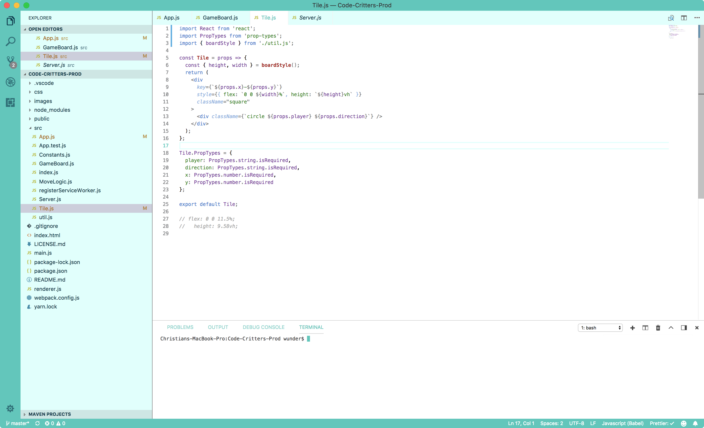
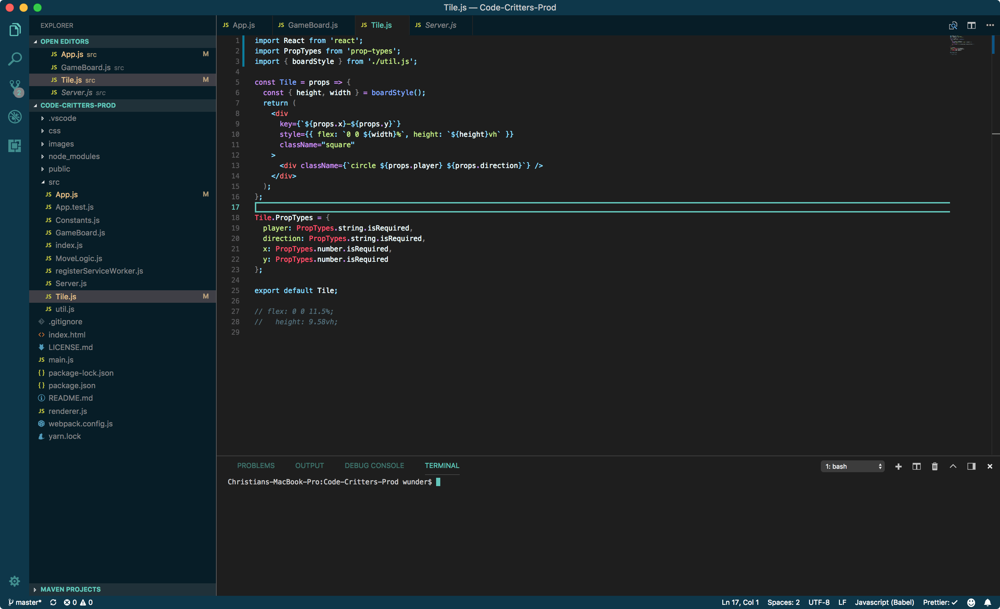

# Woz-U Themes for Visual Studio Code

This repo contains two themes using Woz-U official colors. One `light theme` and one `dark theme` are both contained in the themes folder. To install the theme follow the steps below.

## Light Theme:



## Dark Theme:



### 1. Download

To install the theme extension first open the terminal and navigate to `<user home>/.vscode/extensions`. Extensions are installed in your extensions folders. Depending on your platform, the global location is in the following folders:

* Windows: `%USERPROFILE%\.vscode\extensions`
* Mac: `~/.vscode/extensions`
* Linux: `~/.vscode/extensions`

Once inside this location, you can then clone this repo directly to your `extensions` folder using the command directly below.

```text
git clone https://github.com/codercamps/vs-code-themes.git
```

### 2. Reload VS Code

Once the repo has been cloned if you have an instance of VS Code already open use the shortcut `Ctrl + Shift + P (Mac: Command + Shift + P)` to open the command palette and type `>reload` followed by `enter` to reload that instance of VS Code.

### 3. Choose Theme

Once VS Code has reopened use the same shortcut `Ctrl + Shift + P (Mac: Command + Shift + P)` and this time enter `theme` and then select `Preferences: Color Theme`. Once the drop-down list appears, use your keyboard arrows to navigate up and down the list and then choose which theme you would like.

### 4. Contribute

Read the file named `vsc-extension-quickstart.md` for more info on making changes to the themes. Keep in mind a few things...

* If you directly edit the copy of the theme inside your `.vscode\extension` folder the next time you reload vs code the theme will update.
* Clone a new copy of the repo in a different location for editing the themes, then run the app with `F5` to launch a sandboxed instance of vs code which you can use `Ctrl + R` to reload.

**Happy Coding!**
